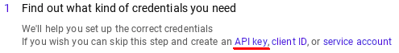

# YoutubeAutotranslateCanceler

I was annoyed by YouTube changing video titles to poorly auto-translated versions, so I made this script using YouTube Data API to retrive original titles and change them back.

# How to use

First, you need a userscript extension, such as Tampermonkey for [Chrome](https://chrome.google.com/webstore/detail/tampermonkey/dhdgffkkebhmkfjojejmpbldmpobfkfo) or [Firefox](https://addons.mozilla.org/en-US/firefox/addon/tampermonkey/). Next, click [here](https://github.com/pcouy/YoutubeAutotranslateCanceler/raw/master/AntiTranslate.user.js) to install the userscript.

Unfortunately, this requires an API key to work. However, requests to this API are free. 

### Instructions on how to get an API key

Detailed instructions and screenshots are provided below

##### TL;DR : 

You can browse to [Google's official support](https://developers.google.com/youtube/v3/getting-started) in order to know how to get an API key. 
Then, you need to enable Youtube Data API for this key in [Google Developers Console](https://console.developers.google.com/apis/api/youtube.googleapis.com/) and you're good to go.
When you first run the script, it prompts you for an API key until it manages to complete a successful request.

Head to [Google Developers Console](https://console.developers.google.com/) and click "Select a project" (step 1).

* * *

Then, you need to create a new project (steps 2 and 3) which you can name as you want.

* * *

Once your project is created and active in your dashboard, you need to add APIs and services. To do that, just click on the link (step 4), then search for YouTube Data API and click "enable" (step 5). 

* * *

It asks you to create credentials in order to use the API, just click "create credentials" (step 6), then "API key" in the next page (step 7). 

* * *

On the API key creation page, you need to set a name (step 8-1) and it is generally considered good practices to set application restrictions (step 8-2). 

* * *

Don't click "create" yet (if you did, just click the pencil icon next to your newly created API key), select the "API restrictions" tab (step 8-3) then select "YouTube DATA API v3" (step 9-1) before clicking the "create" or "save" button (step 9-2).

* * *

 You should be redirected to your credentials manager, from where you can copy your API key (step 10) in order to paste it when the script prompts you for it.

